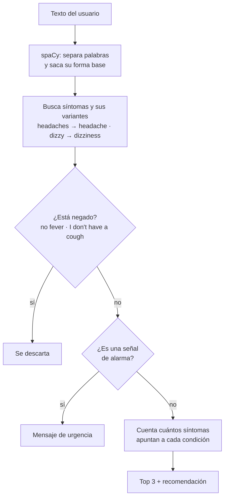

# Asistente de síntomas con NLP

Chatbot de consola que lee cómo te sientes, escrito en inglés y con tus propias palabras, reconoce los síntomas y sugiere las causas comunes que más encajan, con una recomendación básica para cada una. Si detecta algo que puede ser una emergencia, como dolor de pecho o dificultad para respirar, deja todo lo demás y te dice que busques atención médica de inmediato.

> Proyecto final del **Microsoft Python Development Professional Certificate** (Coursera). **No da diagnósticos ni reemplaza a un médico.**

## Ejemplo

```
$ python chatbot_medico.py "I have a fever, I've been coughing and I feel really tired"

I understand you have: fever, cough, fatigue.
Some common causes for these symptoms are:
- common cold (3 matching symptoms)
  Rest, stay hydrated, and consider over-the-counter medications for symptom relief.
- flu (3 matching symptoms)
  Rest, stay hydrated, and consider over-the-counter medications for symptom relief.
- infection (1 matching symptom)
  Consult a doctor for diagnosis and appropriate treatment, which may include antibiotics.
```

```
$ python chatbot_medico.py "I have a cough and chest pain"

Some of what you describe (chest pain) can be a sign of something serious.
Please call emergency services or go to the nearest emergency room now.
```

## Cómo funciona



Toda la información médica está en `medical_data.json`:

- **symptoms**: 27 síntomas y las condiciones con las que se relacionan, ordenadas de la más común a la menos común.
- **aliases**: otras formas de decir cada síntoma (*tired*, *exhausted* → *fatigue*).
- **recommendations**: un consejo general por condición.
- **red_flags**: frases que indican una posible emergencia.

Para agregar un síntoma o una variante no hace falta tocar el código.

En [MEJORAS.md](MEJORAS.md) explico qué corregí de la primera versión y cómo lo medí.

## Cómo correrlo

```bash
pip install -r requirements.txt
python -m spacy download en_core_web_sm

python chatbot_medico.py                                  # modo conversación
python chatbot_medico.py "I feel dizzy and nauseous"      # una sola pregunta
python evaluar.py                                         # mide los resultados con las 40 frases
python -m pytest                                          # tests
```

## Archivos

- `chatbot_medico.py`: extracción de síntomas, negaciones, señales de alarma, ranking y conversación por consola.
- `medical_data.json`: síntomas, variantes, condiciones, recomendaciones y señales de alarma.
- `casos_prueba.json` y `evaluar.py`: frases de prueba y script de evaluación.
- `tests/`: pruebas automáticas.

## Tecnologías

Python y spaCy (`en_core_web_sm`, con `PhraseMatcher` para buscar por palabra y por forma base).
