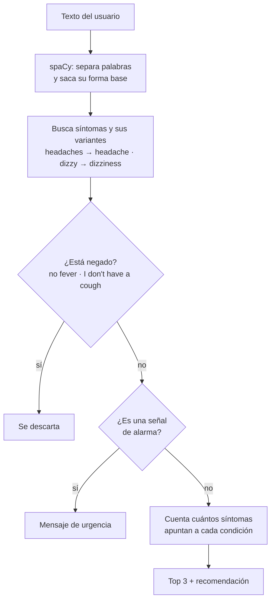

# Asistente de síntomas con NLP

Chatbot de consola que lee cómo te sientes, escrito en inglés y con tus propias palabras, reconoce los síntomas y sugiere las causas comunes que más encajan, con una recomendación básica para cada una. Si detecta algo que puede ser una emergencia, como dolor de pecho o dificultad para respirar, deja todo lo demás y te dice que busques atención médica de inmediato.

> Es un proyecto de práctica de procesamiento de lenguaje natural. **No da diagnósticos ni reemplaza a un médico.**

## Ejemplo

```
$ python chatbot_medico.py "I have a fever, I've been coughing and I feel really tired"

I understand you have: fever, cough, fatigue.
Some common causes for these symptoms are:
- common cold (3 matching symptoms)
  Rest, stay hydrated, and consider over-the-counter medications for symptom relief.
- flu (3 matching symptoms)
  Rest, stay hydrated, and consider over-the-counter medications for symptom relief.
- infection (1 matching symptom)
  Consult a doctor for diagnosis and appropriate treatment, which may include antibiotics.
```

```
$ python chatbot_medico.py "I have a cough and chest pain"

Some of what you describe (chest pain) can be a sign of something serious.
Please call emergency services or go to the nearest emergency room now.
```

## Cómo funciona



Toda la información médica está en `medical_data.json`:

- **symptoms**: 27 síntomas y las condiciones con las que se relacionan, ordenadas de la más común a la menos común.
- **aliases**: otras formas de decir cada síntoma (*tired*, *exhausted* → *fatigue*).
- **recommendations**: un consejo general por condición.
- **red_flags**: frases que indican una posible emergencia.

Para agregar un síntoma o una variante no hace falta tocar el código.

## Qué cambió respecto a la primera versión

La primera versión funcionaba, pero al probarla con frases normales encontré varios problemas:

1. **No usaba el JSON.** El script tenía escrita a mano una copia más chica de los datos (7 síntomas), así que 20 de los 27 síntomas del JSON nunca se reconocían.
2. **Solo reconocía la palabra exacta.** *headache* sí, pero *headaches*, *coughing* o *tired* no.
3. **No entendía negaciones.** "I have a headache but no fever" devolvía *headache* y *fever*.
4. **No distinguía lo urgente.** "I have chest pain" se trataba igual que un resfrío.
5. **Listaba todas las condiciones posibles**, incluidas algunas graves, aunque solo coincidiera un síntoma. Ahora muestra las 3 más probables.

Para medir el cambio escribí 40 frases de prueba (`casos_prueba.json`) con los síntomas que debería encontrar en cada una, incluyendo negaciones, emergencias y algunas frases difíciles a propósito:

| | Versión anterior | Versión actual |
|---|---|---|
| Frases resueltas perfecto | 7 de 40 | 38 de 40 |
| Síntomas detectados | 12 de 39 (31 %) | 37 de 39 (95 %) |
| Síntomas detectados que eran correctos | 12 de 17 (71 %) | 37 de 38 (97 %) |
| Emergencias detectadas | 0 de 6 | 6 de 6 |

Las dos frases que todavía falla son expresiones coloquiales: *"I've had the runs"* (diarrea) y *"I feel like throwing up"*, que confunde náuseas con vómitos. Resolver ese tipo de casos requeriría un modelo que entienda significado y no solo palabras, por ejemplo con embeddings.

Un detalle importante: las frases de prueba y las variantes de cada síntoma las escribí yo, así que estos números muestran que la lógica funciona. No son una medida de cómo le iría con pacientes reales.

## Cómo correrlo

```bash
pip install -r requirements.txt
python -m spacy download en_core_web_sm

python chatbot_medico.py                                  # modo conversación
python chatbot_medico.py "I feel dizzy and nauseous"      # una sola pregunta
python evaluar.py                                         # mide los resultados con las 40 frases
python -m pytest                                          # tests
```

## Archivos

- `chatbot_medico.py`: extracción de síntomas, negaciones, señales de alarma, ranking y conversación por consola.
- `medical_data.json`: síntomas, variantes, condiciones, recomendaciones y señales de alarma.
- `casos_prueba.json` y `evaluar.py`: frases de prueba y script de evaluación.
- `tests/`: pruebas automáticas.

## Tecnologías

Python y spaCy (`en_core_web_sm`, con `PhraseMatcher` para buscar por palabra y por forma base).
